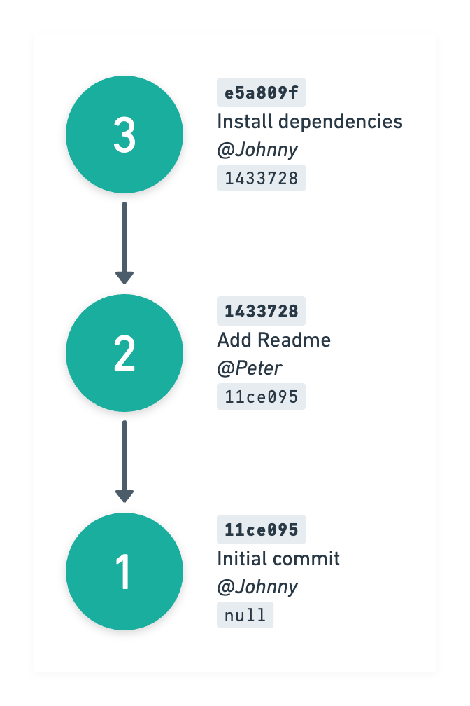
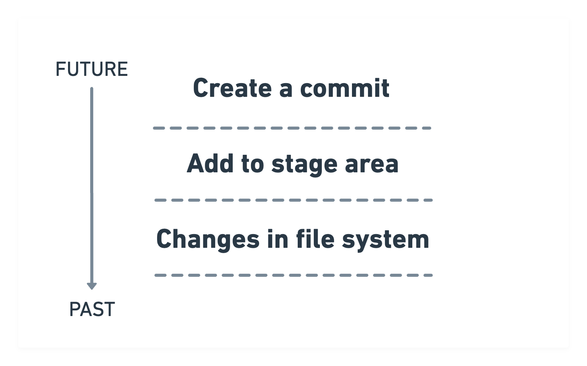
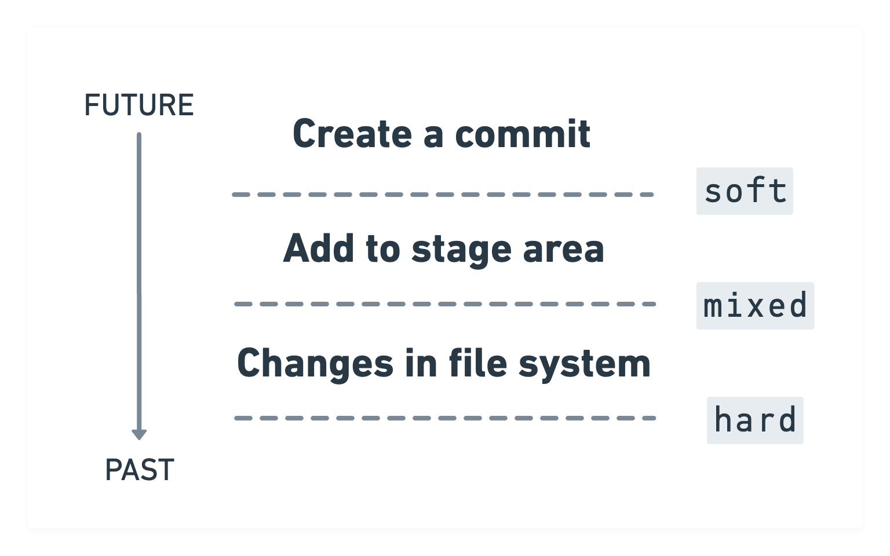

autoscale: true  
slidenumbers: true  
theme: Next, 3
slide-transition: fade(0.3)

# [fit] Git Oops [^*]


<br/>

```swift
let author = "Konstantin Portnov"
let github = "github.com/x0000ff"
```

<br/>


[^*]: the Private Investocat (c) https://octodex.github.com/privateinvestocat/

---

# What is Git? 
# <br/> 
# 🎤

---

# 🤔 What is Git?

[.build-lists: true]

- Database
- Time machine
- Something else?

[.build-lists: false]

---

# 🕵️‍♂️ Let's have a closer look

[.build-lists: true]

[.column]

**Commit has**

- Author
- Message
- Hash (SHA-256)
- Parent Hash (optional)

[.column]



[.build-lists: false]

---


[.build-lists: true]

# Looks similar, no?


---

# 🧙‍♂️ Reset 

---

# Commit creation




---

# How does the `reset` work?




---

# 🛝 Demo time 

---


# 😰 Missed commits

[.column]

You you don't see something in the **git log** or your **GUI client**, that **doesn't mean**, that the changes is **lost**.

If you did commit - you're saved :) 

[.column]

  

---

# 🏎💨 Fast travel

```shell
$ git reset --hard <commit-ish>
```

===

> Do not forget do `git push --force`
> It's safe if you work alone in the branch

---

# 🗺 Use **tags** as breadcrumbs

Do not push them to remote 🙏


---

# 🛝 Bonus Demo time 

---

# 📝 Cheatsheet

| Command | What does? |
| --- | --- |
| `git reset --hard head~N` | Force change current branch head N commits back [^⚠️]
| `git reset --mixed head~N` | Cancel N commits. All changes are **unstaged** [^⚠️]
| `git reset --soft head~N` | Cancel N commits. All changes are **staged** [^⚠️]
| |
| `git tag <NAME>` | Create a tag
| `git tag -d <NAME>` | Remove a tag
| |
| `git cherry-pick <REVISION>` | Duplicates a commit to current branch
| `git reflog` | See histroy of changes of the current branch head
| `git commit --amend --no-edit` | Add all the staged changes to the last commit [^⚠️]

[^⚠️]: `push --force` needed

---

# 🎉 Fin

---

# ☺️ Thanks a lot!


---

# 🤔 Q & A

## This talk is here: shorturl.at/aeiJS

