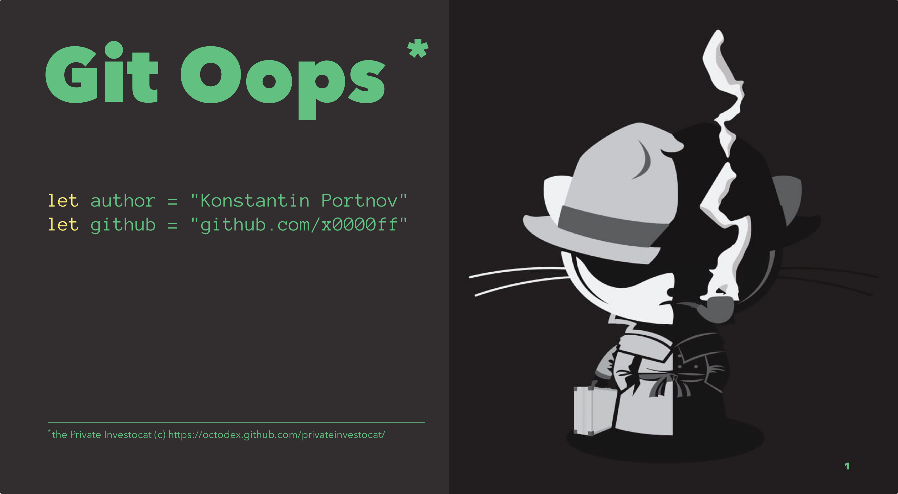

# Git: Oops

- [Source](./Git%20Oops.md)
- [Generated PDF](./Git%20Oops.pdf)

> Presentation was made with [Deckset](https://www.decksetapp.com) and [MacDown](https://macdown.uranusjr.com/)

## Notes

- Create 3 commits
- `reset head~2`
- Ooops. We lost **commit 3**
- `reflog`
- `show <hash>`
- `cherry-pick <3-hash>`
- LOOK new commit is not the same as the old one. WHY?
- Create commits **4** and **5**
- `tag before-join`
- `reset —soft head~2`
- `commit -m "4 + 5"`
- `reset —hard before-join` 

BACK to SLIDES

- `commit —amend`
- What more? Questions?
- Take any wallapop branch and change applying resets.